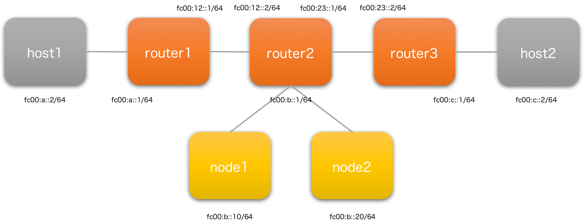

# SRv6-playground

A Vagrantfile for playing IPv6 Segment Routing (SRv6) based on Ubuntu 17.04.

## Topology


## Run

```bash
$ vagrant up
$ sudo su
$ ./root/scripts/create-namespaces.sh
```

## More Detail (in Japanese)
- http://skjune12.hatenadiary.com/entry/2017/12/16/223455